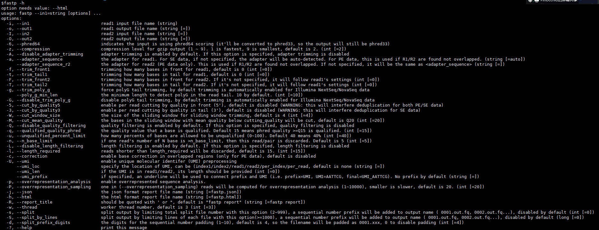

```
##====数据准备及环境加载==== 
> source /root/software/miniconda3/etc/profile.d/conda.sh 
> usearch=/root/WORKSPACE/11.Meta/software/usearch10_32 
> export PATH=\$PATH:/root/WORKSPACE/11.Meta/software/div-utils-master 
> conda activate Meta

#創建自己工作目錄 
> cd /root/WORKSPACE_Stu/11.Meta/usearch 
> mkdir $(whoami) 
> cd $(whoami)

#获取原始数据 
> pwd
注：显示/root/WORKSPACE_Stu/11.Meta/usearch/\[自己帐号ID\]为正确 
> mkdir raw_data 
> ln -fs /root/WORKSPACE/11.Meta/raw_data/* ./raw_data/.
```

```
##====Fastp(質控)==== #质控（各样本） 
> pwd
注：显示/root/WORKSPACE_Stu/11.Meta/usearch/\[自己帐号ID\]为正确 
> mkdir clean_data


fastp -i ./Assembly_raw_fq/A1.assembly.fq -W 4 -M 20 -5 -o ./Assembly_clean_fq/A1.assembly.clean.fq -h ./Assembly_clean_fq//A1.assembly.fastp.html -A -l 100
fastp -i ./Assembly_raw_fq/A2.assembly.fq -W 4 -M 20 -5 -o ./Assembly_clean_fq/A2.assembly.clean.fq -h ./Assembly_clean_fq//A2.assembly.fastp.html -A -l 100
fastp -i ./Assembly_raw_fq/A3.assembly.fq -W 4 -M 20 -5 -o ./Assembly_clean_fq/A3.assembly.clean.fq -h ./Assembly_clean_fq//A3.assembly.fastp.html -A -l 100
fastp -i ./Assembly_raw_fq/B1.assembly.fq -W 4 -M 20 -5 -o ./Assembly_clean_fq/B1.assembly.clean.fq -h ./Assembly_clean_fq//B1.assembly.fastp.html -A -l 100
fastp -i ./Assembly_raw_fq/B2.assembly.fq -W 4 -M 20 -5 -o ./Assembly_clean_fq/B2.assembly.clean.fq -h ./Assembly_clean_fq//B2.assembly.fastp.html -A -l 100
fastp -i ./Assembly_raw_fq/B3.assembly.fq -W 4 -M 20 -5 -o ./Assembly_clean_fq/B3.assembly.clean.fq -h ./Assembly_clean_fq//B3.assembly.fastp.html -A -l 100
W-4 4个碱基  M 质量大于20 -5每5个做平均值  -o为-i的输出


```

```
##====拼接数据====
#去引物

##====拼接数据==== #去引物 
> pwd
注：显示/root/WORKSPACE_Stu/11.Meta/usearch/\[自己帐号ID\]为正确 
> mkdir dePrimer

cutadapt -g GTGCCAGCMGCCGCGGTAA -G CCGTCAATTCMTTTRAGTTT -e 0.2 -o ./dePrimer/A1.R1.clean.strip.fq -p ./dePrimer/A1.R2.clean.strip.fq ./clean_data/A1.R1.clean.fq ./clean_data/A1.R2.clean.fq
cutadapt -g GTGCCAGCMGCCGCGGTAA -G CCGTCAATTCMTTTRAGTTT -e 0.2 -o ./dePrimer/A2.R1.clean.strip.fq -p ./dePrimer/A2.R2.clean.strip.fq ./clean_data/A2.R1.clean.fq ./clean_data/A2.R2.clean.fq
cutadapt -g GTGCCAGCMGCCGCGGTAA -G CCGTCAATTCMTTTRAGTTT -e 0.2 -o ./dePrimer/A3.R1.clean.strip.fq -p ./dePrimer/A3.R2.clean.strip.fq ./clean_data/A3.R1.clean.fq ./clean_data/A3.R2.clean.fq
cutadapt -g GTGCCAGCMGCCGCGGTAA -G CCGTCAATTCMTTTRAGTTT -e 0.2 -o ./dePrimer/B1.R1.clean.strip.fq -p ./dePrimer/B1.R2.clean.strip.fq ./clean_data/B1.R1.clean.fq ./clean_data/B1.R2.clean.fq
cutadapt -g GTGCCAGCMGCCGCGGTAA -G CCGTCAATTCMTTTRAGTTT -e 0.2 -o ./dePrimer/B2.R1.clean.strip.fq -p ./dePrimer/B2.R2.clean.strip.fq ./clean_data/B2.R1.clean.fq ./clean_data/B2.R2.clean.fq
cutadapt -g GTGCCAGCMGCCGCGGTAA -G CCGTCAATTCMTTTRAGTTT -e 0.2 -o ./dePrimer/B3.R1.clean.strip.fq -p ./dePrimer/B3.R2.clean.strip.fq ./clean_data/B3.R1.clean.fq ./clean_data/B3.R2.clean.fq

#-g换正向引物  0.2错误率（小于0.2才认为是引物并去除）
#-g或者-i取决于软件

#拼接 \> pwd
注：显示/root/WORKSPACE_Stu/11.Meta/usearch/\[自己帐号ID\]为正确 \>
mkdir Assembly_raw_fq

$usearch -fastq_mergepairs ./dePrimer/A1.R1.clean.strip.fq -reverse ./dePrimer/A1.R2.clean.strip.fq -fastqout ./Assembly_raw_fq/A1.assembly.fq -relabel A1_ -sample A1
$usearch -fastq_mergepairs ./dePrimer/A2.R1.clean.strip.fq -reverse ./dePrimer/A2.R2.clean.strip.fq -fastqout ./Assembly_raw_fq/A2.assembly.fq -relabel A2_ -sample A2
$usearch -fastq_mergepairs ./dePrimer/A3.R1.clean.strip.fq -reverse ./dePrimer/A3.R2.clean.strip.fq -fastqout ./Assembly_raw_fq/A3.assembly.fq -relabel A3_ -sample A3
$usearch -fastq_mergepairs ./dePrimer/B1.R1.clean.strip.fq -reverse ./dePrimer/B1.R2.clean.strip.fq -fastqout ./Assembly_raw_fq/B1.assembly.fq -relabel B1_ -sample B1
$usearch -fastq_mergepairs ./dePrimer/B2.R1.clean.strip.fq -reverse ./dePrimer/B2.R2.clean.strip.fq -fastqout ./Assembly_raw_fq/B2.assembly.fq -relabel B2_ -sample B2
$usearch -fastq_mergepairs ./dePrimer/B3.R1.clean.strip.fq -reverse ./dePrimer/B3.R2.clean.strip.fq -fastqout ./Assembly_raw_fq/B3.assembly.fq -relabel B3_ -sample B3
relabel 做标记，用A1_   $符号不能去除

#拼接后质控 \> pwd
注：显示/root/WORKSPACE_Stu/11.Meta/usearch/\[自己帐号ID\]为正确 \>
mkdir Assembly_clean_fq

fastp -i ./Assembly_raw_fq/A1.assembly.fq -W 4 -M 20 -5 -o ./Assembly_clean_fq/A1.assembly.clean.fq -h ./Assembly_clean_fq//A1.assembly.fastp.html -A -l 100
fastp -i ./Assembly_raw_fq/A2.assembly.fq -W 4 -M 20 -5 -o ./Assembly_clean_fq/A2.assembly.clean.fq -h ./Assembly_clean_fq//A2.assembly.fastp.html -A -l 100
fastp -i ./Assembly_raw_fq/A3.assembly.fq -W 4 -M 20 -5 -o ./Assembly_clean_fq/A3.assembly.clean.fq -h ./Assembly_clean_fq//A3.assembly.fastp.html -A -l 100
fastp -i ./Assembly_raw_fq/B1.assembly.fq -W 4 -M 20 -5 -o ./Assembly_clean_fq/B1.assembly.clean.fq -h ./Assembly_clean_fq//B1.assembly.fastp.html -A -l 100
fastp -i ./Assembly_raw_fq/B2.assembly.fq -W 4 -M 20 -5 -o ./Assembly_clean_fq/B2.assembly.clean.fq -h ./Assembly_clean_fq//B2.assembly.fastp.html -A -l 100
fastp -i ./Assembly_raw_fq/B3.assembly.fq -W 4 -M 20 -5 -o ./Assembly_clean_fq/B3.assembly.clean.fq -h ./Assembly_clean_fq//B3.assembly.fastp.html -A -l 100
-l 100 质控后序列长度小于100则不要

##====代表序列数据==== #去冗余 
> pwd 
注：显示/root/WORKSPACE_Stu/11.Meta/usearch/\[自己帐号ID\]为正确 
> mkdir dereplicate 
> cat ./Assembly_clean_fq/*fq > ./Assembly_clean_fq/all.assembly.clean.fq     *fq选取所有以fq结尾文件  >输出到后面的文件

> $usearch -fastx_uniques ./Assembly_clean_fq/all.assembly.clean.fq -sizeout -relabel Uniq -fastaout ./dereplicate/uniques.fa -threads 2   #sizeout 将数量输出出来 threads 线程数量（2）

#聚类 
> pwd
注：显示/root/WORKSPACE_Stu/11.Meta/usearch/\[自己帐号ID\]为正确 
> mkdir uparse 
> $usearch -cluster_otus ./dereplicate/uniques.fa -otus ./uparse/otus.uparse.fa -relabel OTU\_
```

```
##====OTU物种丰度表==== #物种注释 
> pwd
注：显示/root/WORKSPACE_Stu/11.Meta/usearch/\[自己帐号ID\]为正确 
> mkdir sintax_16S 
> $usearch -sintax ./uparse/otus.uparse.fa -db /root/WORKSPACE/11.Meta/database/16S_greengenes_v13.8.fa -threads 2 -strand both -tabbedout ./sintax_16S/sintax_16S.txt -sintax_cutoff 0.8                
#16S_greengenes_v13.8 16S数据库; 0.8 阈值，大于0.8才会输出

#OTU表 
> pwd
注：显示/root/WORKSPACE_Stu/11.Meta/usearch/\[自己帐号ID\]为正确 
> $usearch -otutab ./Assembly_clean_fq/all.assembly.clean.fq -otus ./uparse/otus.uparse.fa -otutabout ./sintax_16S/otutab.uparse.txt -threads 2
#界面结果中matcher不是100%是因为去除了嵌合体

# 获取OTU表格的统计信息
$ usearch -otutab_stats ./sintax_16S/otutab.uparse.txt -output report.txt cat report.txt           #把所有样本量放到同一水平，后面统计才有意义 要改成上一步看到的最小值
#取最小的样本值进行抽平
> /root/WORKSPACE/11.Meta/software/usearch11 -otutab_rare ./sintax_16S/otutab.uparse.txt -sample_size 71442 -output ./sintax_16S/otutab_norm.txt #OTU物种丰度表 \> pwd
注：显示/root/WORKSPACE_Stu/11.Meta/usearch/\[自己帐号ID\]为正确 \
> cut -f1,4 ./sintax_16S/sintax_16S.txt | otutable_annotation - ./sintax_16S/otutab_norm.txt > ./sintax_16S/Table.otu.raw.txt   #cut以tab分隔输出第一列和第四列  重定向到另一个文件

#各分类水平物种组成 
# 后续使用抽平后的OTU表进行操作 
> pwd
注：显示/root/WORKSPACE_Stu/11.Meta/usearch/\[自己帐号ID\]为正确               
> mkdir tax   #看门、纲目。。。
$usearch -sintax_summary ./sintax_16S/sintax_16S.txt -otutabin ./sintax_16S/otutab_norm.txt -output ./tax/Table_Phylum.txt -rank p
$usearch -sintax_summary ./sintax_16S/sintax_16S.txt -otutabin ./sintax_16S/otutab_norm.txt -output ./tax/Table_Class.txt -rank c
$usearch -sintax_summary ./sintax_16S/sintax_16S.txt -otutabin ./sintax_16S/otutab_norm.txt -output ./tax/Table_Order.txt -rank o
$usearch -sintax_summary ./sintax_16S/sintax_16S.txt -otutabin ./sintax_16S/otutab_norm.txt -output ./tax/Table_Family.txt -rank f
$usearch -sintax_summary ./sintax_16S/sintax_16S.txt -otutabin ./sintax_16S/otutab_norm.txt -output ./tax/Table_Genus.txt -rank g
```

```
#alpha-diveristy 
> pwd
注：显示/root/WORKSPACE_Stu/11.Meta/usearch/\[自己帐号ID\]为正确 
> mkdir alphaDiv 
> $usearch -alpha_div ./sintax_16S/otutab_norm.txt -output ./alphaDiv/alpha.raw.txt

#beta-diveristy 
> pwd
注：显示/root/WORKSPACE_Stu/11.Meta/usearch/\[自己帐号ID\]为正确 
> mkdir betaDiv 
> $usearch -beta_div ./sintax_16S/otutab_norm.txt -filename_prefix ./betaDiv/betaDiv\_
```

```
#功能预测 
> pwd
注：显示/root/WORKSPACE_Stu/11.Meta/usearch/\[自己帐号ID\]为正确      #16S数据库放进picrust2，将功能基因数拷贝出来
> mkdir picrust2 
> conda activate picrust2   #换一个工作环境
> picrust2_pipeline.py -s ./uparse/otus.uparse.fa -i ./sintax_16S/otutab_norm.txt -o ./picrust2/out -p 2 -r /root/WORKSPACE/11.Meta/software/picrust2-2.3.0-b/picrust2/default_files/prokaryotic/pro_ref --in_traits KO

> pathway_pipeline.py -i ./picrust2/out/KO_metagenome_out/pred_metagenome_unstrat.tsv.gz -o ./picrust2/out/KEGG_pathways_out --no_regroup --map /root/WORKSPACE/11.Meta/software/picrust2-2.3.0-b/picrust2/default_files/pathway_mapfiles/KEGG_pathways_to_KO.tsv

> add_descriptions.py -i ./picrust2/out/KEGG_pathways_out/path_abun_unstrat.tsv.gz --custom_map_table /root/WORKSPACE/11.Meta/software/picrust2-2.3.0-b/picrust2/default_files/description_mapfiles/KEGG_L1_info.tsv.gz -o ./picrust2/Table_KEGG_L1_temp.txt

> add_descriptions.py -i ./picrust2/out/KEGG_pathways_out/path_abun_unstrat.tsv.gz --custom_map_table /root/WORKSPACE/11.Meta/software/picrust2-2.3.0-b/picrust2/default_files/description_mapfiles/KEGG_L2_info.tsv.gz -o ./picrust2/Table_KEGG_L2_temp.txt

> add_descriptions.py -i ./picrust2/out/KEGG_pathways_out/path_abun_unstrat.tsv.gz --custom_map_table /root/WORKSPACE/11.Meta/software/picrust2-2.3.0-b/picrust2/default_files/description_mapfiles/KEGG_L3_info.tsv.gz -o ./picrust2/Table_KEGG_L3_temp.txt

> cut -f 2- ./picrust2/Table_KEGG_L1_temp.txt > ./picrust2/Table_KEGG_L1_temp2.txt && Rscript /root/WORKSPACE/11.Meta/software/group_value_freq.R ./picrust2/Table_KEGG_L1_temp2.txt ./picrust2/Table_KEGG_L1.txt

> cut -f 2- ./picrust2/Table_KEGG_L2_temp.txt > ./picrust2/Table_KEGG_L2_temp2.txt && Rscript /root/WORKSPACE/11.Meta/software/group_value_freq.R ./picrust2/Table_KEGG_L2_temp2.txt ./picrust2/Table_KEGG_L2.txt

> cut -f 2- ./picrust2/Table_KEGG_L3_temp.txt > ./picrust2/Table_KEGG_L3_temp2.txt && Rscript /root/WORKSPACE/11.Meta/software/group_value_freq.R ./picrust2/Table_KEGG_L3_temp2.txt ./picrust2/Table_KEGG_L3.txt
```