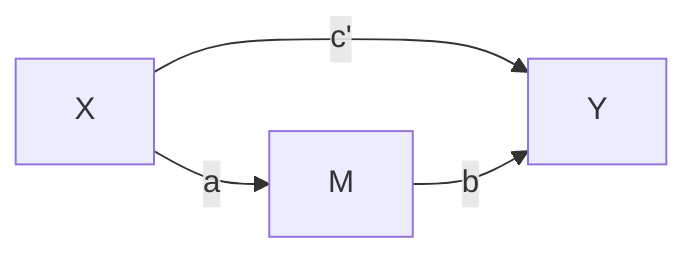

---
 Bayesian Mediation Analysis 
 2024/27/12
---

## 编程环境
pymc包 5.x环境及以上  用python3.9-3.11之间的版本（Conda创建环境时指定）
```
conda create -n pymc python=3.10
conda install -c conda-forge "pymc>=5"
```
检查Pymc（用于搭建模型）、Numpy、Pytensor（用于计算模型）库等是否安装

## Overview

---

### Required Libraries
- **arviz**: For posterior analysis and visualization.
- **matplotlib**: To create plots.
- **numpy**: For numerical computations.
- **pymc**: For Bayesian modeling.
- **seaborn**: To create pair plots.
- **pandas**: To structure data conveniently in DataFrames.
- **pytensor**用于处理数值计算、自动微分和优化
```
import arviz as az
import matplotlib.pyplot as plt
import numpy as np
import pymc as pm
import seaborn as sns
from pandas import DataFrame
import pytensor as pt
```
---
## 全文设置
```
# 设置 Matplotlib 配置
matplotlib.use("TkAgg")  # 或者 "Agg", "Qt5Agg", 根据环境选择
plt.rcParams.update({"font.size": 14})
```
这个是避免matplotlib库和pycharm自带图形展示冲突，如此设置后如果代码里有`plt.show()`需要人为关闭才能继续运行代码

```
plt.rcParams.update({"font.size": 14})  
seed = 42
rng = np.random.default_rng(seed)  
````
`plt.rcParams.update({"font.size": 14})`  #修改` Matplotlib` 全局的绘图参数，将所有接下来生成的图形中的文本（如标题、轴标签、图例等）字体大小设置为 14。
作用：统一调整所有图形的字体大小，以便在报告或演示中更清晰地显示文字；避免设置每个图形的字体的大小，简化代码。
seed = 42 #设置一个固定的随机数种子，用于生成可重复的随机数
`rng = np.random.default_rng(seed)`  #创建一个新的随机数生成器实例（**Generator**），并将种子设置为 42。
作用：后面演示数据是随机生成的，控制随机数的生成，使代码的输出结果在每次运行时保持一致。这在调试和科研中非常重要，因为它保证了实验的**可重复性**；
**default_rng**相比于之前的seed被更推荐使用，适合长生命周期项目和更复杂的随机数生成需求。

---

## Data Generation

#链接法


#流程图法（目前还很丑）

```
def make_data():
    N = 75
    a, b, cprime = 0.5, 0.6, 0.3
    im, iy, σm, σy = 2.0, 0.0, 0.5, 0.5
    x = rng.normal(loc=0, scale=1, size=N)  # Independent variable
    m = im + rng.normal(loc=a * x, scale=σm, size=N)  # Mediator
    y = iy + (cprime * x) + rng.normal(loc=b * m, scale=σy, size=N)  # Dependent variable
    print(f"True direct effect = {cprime}")
    print(f"True indirect effect = {a * b}")
    print(f"True total effect = {cprime + a * b}")
    return x, m, y

```
def `make data`() #定义函数
作用：负责生成数据并打印中介效应相关的统计值。

- **N**: 数据样本量
- **a, b, cprime**: a为自变量对中介变量的影响系数；b为中介变量对自变量的影响系数；cprime为自变量对因变量的直接影响系数（控制了中介变量后）。
- **im, iy, $\sigma$m, $\sigma$y**: im为中介变量的截距；iy为因变量的截距；$\sigma$m为中介变量的误差标准差；$\sigma$y为因变量的误差标准差。
- **x**:自变量，`rng.normal`用于生成标准正态分布
The function prints the true direct, indirect, and total effects.
- **m**:中介变量，这里是做最简单的线性拟合。m = im + $a \cdot x$ + 误差项
三项依次为截距，自变量x的线性效应，误差项为正态误差项（均值为0，标准差为$\sigma$m）
- **y**:因变量，y = $iy +  c' \cdot x +b \cdot m + 误差项$
四项依次为截距，自变量x的直接效应（系数为cprime），中介变量m的线性效应（系数为b），正态误差项（均值为0，标准差为$\sigma$y）
print(): 打印结果，依次为直接效应，间接效应，总效应（前两者之和）

产生结果
```
True direct effect = 0.3
True indirect effect = 0.3
True total effect = 0.6
```


分别展示了x,y,m的单变量直方图表示分布，以及x,y,m的相关关系图


---

## Mediation Model
```
def mediation_model(x, m, y):
    with pm.Model() as model:
# Intercept priors
        im = pm.Normal("im", mu=0, sigma=10)
        iy = pm.Normal("iy", mu=0, sigma=10)
# Slope priors
        a = pm.Normal("a", mu=0, sigma=10)
        b = pm.Normal("b", mu=0, sigma=10)
        cprime = pm.Normal("cprime", mu=0, sigma=10)    
# Noise priors
        σm = pm.HalfCauchy("\u03c3m", 1)
        σy = pm.HalfCauchy("\u03c3y", 1)
#Likelihood
        pm.Normal("m_likelihood", mu=im + a * x, sigma=σm, observed=m)
        pm.Normal("y_likelihood", mu=iy + b * m + cprime * x, sigma=σy, observed=y)
#Calculate quantities of interest
        pm.Deterministic("indirect_effect", a * b)
        pm.Deterministic("total_effect", a * b + cprime)
return model
```
The `mediation_model` function defines the PyMC model for mediation analysis:
### 模型结构
1. **截距项**（Intercept priors)
2. **斜率项**（Slope priors）
3. **噪声项**（Noise priors）
4. **似然函数**（Likelihood）
5. **派生量**（Derived quantities）

### 模型定义的核心部分
1. **Intercept priors**:
   - `im` and `iy`: Intercepts for mediator and outcome.
2. **Slope priors**:
   - `a`, `b`, `cprime`: Effect sizes for the paths.
3. **Noise priors**:
	-$\sigma$m, $\sigma$y: Noise levels.
σm = pm.HalfCauchy("\u03c3m", 1) #误差项采用半柯西分布（非负分布），尺度参数为1   \u03c3m python中用unicode表示σ
作用：用于定义先验分布

### 似然函数
1.**m的生成路径（中介变量）**：
m ~ Normal($i_m + a \cdot x_i, \sigma_M$)
2.**y的生成路径（因变量）**：
y ~ Normal($i_y + c' \cdot x_i + b \cdot m_i, \sigma_Y$)

### 派生量:
```
		pm.Deterministic("indirect_effect", a * b)
		pm.Deterministic("total_effect", a * b + cprime)
```
`indirect_effect = a * b`				#间接效应
`total_effect = a * b + cprime`	#总效应
**这段代码展现了一个完整的贝叶斯中介分析模型，可以用来分析中介效应是否显著以及各路径的贡献。**


### 可视化
```
if __name__ == '__main__':
    # 生成数据
    x, m, y = make_data()

    # 可视化数据对比图
    sns.pairplot(DataFrame({"x": x, "m": m, "y": y}))

    # 构建中介模型
    model = mediation_model(x, m, y)

    # 生成并保存模型结构图
    pm.model_to_graphviz(model).render("mediation_model_structure", format="png")  # 保存为文件
```
`make data` 											   #生成数据集，前面已经定义
`sns.pairplot()` 								   #使用 Seaborn 库生成一个 pairplot，可视化 x、m 和 y 变量之间的关系。pairplot 会展示出每一对变量之间的散点图以及每个变量的分布。
`model = mediation_model(x, m, y)` #传入x, m, y到model中
`pm.model_to_graphviz(model)`		   #pymc提供的一个可视化工具用于将模型的概率图（probabilistic graphical model, PGM）以图的形式显示。生成的是一张有向图，显示模型中各随机变量及其相互关系。
`render()`将图形保存为一个文件

**说明：**
为什么需要`if __name__ == '__main__':`**???**
首先这是操作系统的区别，windows系统在没有`if __name__ == '__main__':`时，脚本中的所有代码都会在脚本被导入时执行。通过`if __name__ == '__main__':`的控制，只有在该脚本作为主程序直接运行时，这些代码才会被执行，而在作为模块被导入时，不会执行这些代码。


**结构模型图用途：**

- 1.直观可视化：显示变量及其依赖关系（例如先验分布、条件分布、观测变量等）。
- 2.模型验证：确认模型的构造是否符合预期。
- 3.沟通交流：与他人分享模型时，用图形描述比文字更易理解。

---

### 后验分布

```
with model:
    result = pm.sample(tune=4000, target_accept=0.9, random_seed=42)
```
**pm.sample:** 
- PyMC 的核心函数，用于进行后验分布的采样。
- 使用指定的采样算法（默认是 NUTS，即 No-U-Turn Sampler）来生成样本。

**参数解析：**
- 1.tune=4000
	- 含义： 调整期（tuning phase）的迭代次数。
	- 目的： 在采样开始之前，调整采样器的超参数（如步长），以提高采样效率。
	- 注意： 调整期生成的样本不会保留在最终的结果中。
- 2.target_accept=0.9
	- 含义： 设置目标接受率（target acceptance rate）。
	- 目的：  采样器会尝试使跳跃接受率接近 0.9，以平衡探索效率与样本质量。
	- 默认值： 通常是 0.8，这里调高到 0.9，意味着希望跳跃更小、更精细，从而提高采样稳定性（适用于复杂或高度相关的后验分布）。
- 3.random_seed=42
	- 含义： 固定随机数种子。
	- 目的： 保证采样结果可复现，即每次运行生成的样本相同。

**返回值：**
	**result** 是一个 PyMC 的 **MultiTrace** 对象，包含了所有采样的结果，包括模型中每个变量的后验样本。
**MultiTrace** 是 PyMC 用于存储和管理采样结果的核心对象，包含了：模型中所有变量的后验样本；多条链的采样数据；支持分析、可视化的丰富功能。

---

### 分析结果

 ```   # 生成采样结果的 Trace 图
    az.plot_trace(result)
    plt.tight_layout()
    plt.savefig("trace_plots.png")  # 保存为文件

    # 生成后验分布的 Pair 图
    az.plot_pair(
        result,
        marginals=True,
        point_estimate="median",
        figsize=(12, 12),
        scatter_kwargs={"alpha": 0.05},
        var_names=["a", "b", "cprime", "indirect_effect", "total_effect"],
    )
    plt.savefig("posterior_pair_plot.png")  # 保存为文件

    # 生成效果的后验分布图
    ax = az.plot_posterior(
        result,
        var_names=["cprime", "indirect_effect", "total_effect"],
        ref_val=0,
        hdi_prob=0.95,
        figsize=(14, 4),
    )
    ax[0].set_title("direct effect")
	plt.savefig("posterior_distributions.png")  # 保存为文件
    plt.show()   #必须手动关闭才能进行下一步代码，可以选择注释掉
````

- 1. `az.plot_trace(result)`                 **生成采样结果的Trace图**
	- 这是这是 Arviz 库的一个函数，用于绘制贝叶斯采样结果的 Trace 图，即显示每个模型参数的采样轨迹。每个参数的采样轨迹通常是一个样本序列，显示模型在 MCMC（马尔科夫链蒙特卡罗）采样过程中对参数的采样变化情况。
	- Trace 图可以帮助诊断采样的混合情况和收敛性。
- `plt.tight_layout()` #调整图形的布局，使图表元素不重叠，确保图表美观。
- `plt.savefig("trace_plots.png")` #将生成的 Trace 图保存为名为 trace_plots.png 的 PNG 文件。**后面不再赘述**
但需要**注意**， `plt.savefig("trace_plots.png")`必须放在`plt.show()`**之前！！！**`plt.show()`会触发图形的渲染和显示，plt.savefig() 在 plt.show() 后面调用，图形可能已经被“清空”或进入交互模式，导致保存时图形为空白。


- 左图为**迹图**，迹图（Trace Plots）是马尔可夫链蒙特卡洛（MCMC）模拟过程中用来评估链的行为和采样质量的图形表示。每个变量对应一个迹图，它展示了该变量的采样轨迹随迭代步骤的变化情况。右侧的图是**时间序列图**，用于显示每个参数随迭代次数变化的轨迹。对于两种图的结果解释
	- 1.收敛性：理想情况下，迹图应在迭代的后期趋于稳定，这表明链已收敛到目标分布。如果迹图在整个迭代过程中表现出明显的漂移或振荡，可能意味着链未充分收敛。
	- 2.混合性：迹图应显示一定的随机性和变化，以表明链正在有效探索参数空间。如果迹图显得过于平坦或缺乏变化，可能表明链的混合性较差，未能充分覆盖整个后验分布。
	- 3.自相关性：高自相关性意味着连续的采样点之间有很强的依赖关系，可能导致对后验分布的低效探索。通过观察迹图中相邻点的相似性，可以对自相关性有所了解。
	- 4.初始值的效应：迹图的起始部分可能与后续部分不同，这是由于链可能还未摆脱初始状态的影响。因此，分析时应关注链的中后期行为。
	**左图**实线代表第一次运行的MCMC链，虚线分别代表后面运行的MCMC链，不同链之间独立运行。这种对比有助于确认结果的稳定性和一致性。如果这两条线在大致上重合或表现出相似的收敛模式，则增强了我们对采样可靠性的信心。
	在**右图**中，每个参数都有一个对应的时间序列图，横轴表示迭代次数，纵轴表示参数值。通过比较不同参数的时间序列图，我们可以观察到它们的动态行为以及可能的相互关系。

-  2.`az.plot_pair(result, ...)`          **生成采样结果的Pair图**
	- 该函数绘制后验分布的 Pair 图，也叫成对关系图，用于显示多个变量的联合分布。
  	- result 是贝叶斯模型的采样结果。
  	- marginals=True 表示同时绘制每个变量的边际分布（即单变量的分布图）。
  	- point_estimate="median"：在图中标注每个变量的中位数估计值。
  	- figsize=(12, 12)：指定图形的大小。
  	- scatter_kwargs={"alpha": 0.05}：设置散点图的透明度，避免数据点太密集时重叠。
  	- var_names=["a", "b", "cprime", "indirect_effect", "total_effect"]：指定需要显示的变量，通常是模型参数或效应。
- **Pair图解读**

	- 1.对角线上的图：这些是对各个变量的边际分布的单变量图。它们展示了每个变量的概率密度函数（Probability Density Function, PDF）。例如，第一个图展示了变量 a 的 PDF，第二个图展示了变量 b 的 PDF，以此类推。
	- 2.非对角线上的图：这些是双变量图，展示了两个变量之间的联合分布。例如，第一行第二列的图展示了变量 a 和 b 之间的联合分布。这些图可以帮助我们了解变量之间的相关性和依赖关系。
	- 颜色深浅：在双变量图中，点的颜色深浅代表了样本出现的频率。颜色越深，表示该区域的样本出现得越多。
	- 3.中心点：在每个双变量图中都有一个黑色的加号（+），它代表了中位数估计值。这是对两个变量之间关系的中心趋势的一个度量。
	- 4.拟合曲线：在某些双变量图中，还画有拟合曲线（本图没有，因为只有部分合适），如线性回归线或其他类型的平滑曲线。这些曲线帮助我们直观地理解两个变量之间的关系。
	- 5.标题和标签：每个小图的标题和轴标签标识了对应的变量名称。


- 3.`az.plot_posterior(result, ...)`  **生成效果的后验分布图**
	- 该函数用于绘制模型中参数（或效应）的后验分布图
	- `var_names=["cprime", "indirect_effect", "total_effect"]`：指定需要显示后验分布的变量。
	- `ref_val=0`：表示在图上标出参考值 0，用于比较后验分布是否包含 0，进而判断参数或效应的显著性。
	- `hdi_prob=0.95`：表示绘制 高密度区间（HDI, Highest Density Interval），即该区间包含 95% 后验样本点的区域。用来显示模型参数的可信区间。
	- `figsize=(14, 4)`：指定图形的尺寸。
	- `ax[0].set_title("direct effect")`：设置后验分布图的标题为 "direct effect"。
	-`plt.show()`：显示图形。plt.show() 通常会阻塞代码，直到用户手动关闭图表窗口后，才会继续执行后续代码。


---


- 总效应图解读
	- 1.峰顶（Peak）：标记为**c**，代表了总效应的中心估计值。在贝叶斯框架中，这通常是后验分布的平均值或众数。
	- 2.95% 最高密度区间（HDIs）：由两条垂直于x轴的线表示，分别是0.61和0.93。这个区间表示在95%的置信度下，总效应的实际值落在这个范围内。它是基于后验分布的密度最高的区间，因此被称为“最高密度区间”。

- 95% HDI：

	- 1.定义：HDI是基于贝叶斯统计学的概念（和95%置信区间区分），表示在参数的后验分布中，包含95%最高概率密度（或概率质量）的区间。
	- 2.计算：通过计算后验分布并找出包含95%概率密度的区间边界来完成。这通常涉及到后验分布的积分或数值方法。
	- 3.解释：95% HDI意味着根据我们观察到的数据和先验信息，我们有95%的**信心**认为总体参数的真实值落在该区间内。